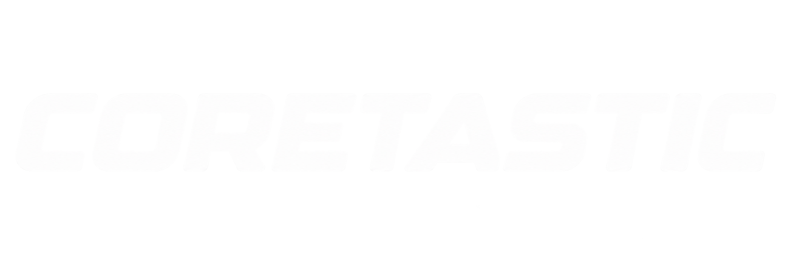

<div align="center">



**Dual-boot selector and USB flasher for MeshCore and Meshtastic on one ESP32-S3 LoRa board.**

[](LICENSE)
[-informational)](#supported-hardware)
[](#supported-hardware)
[](#supported-hardware)

[CLI flasher](#command-line-flasher) · [Build & test](#building-and-testing)

</div>

---

Each firmware occupies a fixed flash slot with separate settings and Bluetooth identity. Switching reboots the device; it never reflashes either application.

> **Status:** the selector and both integrated firmwares build and pass host tests. Physical OLED, radio, switching, and Android pairing are **not yet validated on hardware**.

## Highlights

- **Boot selector** — the Coretastic wordmark, one row per firmware with its mark, an inverted highlight on the choice, and a five-second PRG countdown.
- **Isolated apps** — factory resets, backups, and writes are contained to each app's own flash region.
- **Web flasher + Python CLI** — install, update, backup, restore, and recovery over USB, validated against the release manifest.
- **Release bundles** — validated images, source archives, and checksums.

## Supported hardware

| Board | `--board` | Flash | USB | Status |
| --- | --- | --- | --- | --- |
| Heltec WiFi LoRa 32 **V4.2 / V4.3 OLED** | `heltec-v4-oled` | 16 MiB | Native USB (`303a:1001`) | Supported |
| Heltec WiFi LoRa 32 **V3** | `heltec-v3` | 8 MiB | CP2102 bridge (`10c4:ea60`) | **Experimental** — builds and passes host tests; not yet run on hardware |

Every board gets the same app versions: MeshCore `companion-v1.17.1`, `companion-v1.17.0`, `companion-v1.16.0`, and Meshtastic `v2.7.26.54e0d8d`. Experimental boards are hidden in the web flasher until you tick **Show experimental boards**, and the CLI requires `--experimental`; back up first.

Not supported: V4 R8 and TFT variants (different display power and front-end pins), and non-ESP32 boards such as nRF52 or RP2040, which cannot dual-boot this way. USB cannot identify the PCB — the flasher checks the ESP32-S3, the board's USB interface, and its physical flash size, and you confirm the board.

Secure Boot and flash encryption must be **disabled**; the flasher rejects enabled devices.

Each release offers the latest stable upstream versions that support both the V4.2 and V4.3 LoRa front end, up to three per app. You choose a version when you install or update; the newest is the default. Older Meshtastic stable releases (such as `v2.7.15`) only drive the V4.2 front end, so they are not offered. Pinned revisions are recorded in [`upstream-lock.json`](upstream-lock.json).

## Install and switch

1. Connect USB with a data cable and the LoRa antenna attached. To enter ROM recovery, hold **PRG**, tap **RESET**, release PRG.
2. Run the web flasher locally (see below) and connect the device. Install from a release bundle.
3. First boot defaults to MeshCore; tap PRG to choose Meshtastic.
4. Configure each firmware in its normal Android app (region/frequency, BLE pairing).

Press **RESET** with PRG released to switch: the selector shows the last choice with a five-second countdown. Tap PRG to change it; hold PRG to pause boot.

Keep the flasher and firmware bundle from the **same Coretastic build**. Do not substitute ordinary upstream binaries.

### Backup, updates, recovery

- **Component update** — write only the selected app version and boot metadata, preserving all settings. Installing an *older* version than the one on the device erases that app's settings (and only that app's), because older firmware may not read what a newer one saved; the flasher requires you to confirm this.
- **Full backup** — read the entire flash into a `.ctbackup` file (includes keys and pairings). A backup restores only onto the same board type.
- **Restore** — overwrite the full flash after matching checksums, board, MAC, and partition layout.
- **Selector/bootloader recovery** — repair shared boot files while preserving both apps and their settings.

## Web flasher

The browser flasher runs from localhost with Web Serial. It verifies the installed partition table and bootloader, writes only validated compatible images, and lets you download the full browser log.

```sh
npm ci --prefix web
npm run dev --prefix web
```

No Android USB flashing configuration is validated yet; use a desktop browser or the CLI.

The flasher filters the browser picker to the selected board's USB serial interface. On Linux, choose **Espressif USB JTAG/serial debug unit** for the V4 or **CP2102 USB to UART Bridge Controller** for the V3. If it is absent, verify access to `/dev/ttyACM*` (V4) or `/dev/ttyUSB*` (V3) and close serial monitors, ModemManager, or brltty.

## Command-line flasher

```sh
python3.11 -m venv .venv
. .venv/bin/activate
python -m pip install -r requirements.txt

# Backup, install, update, recover, restore
python scripts/device/flash.py backup  --port /dev/ttyACM0 --board heltec-v4-oled --file before.ctbackup
python scripts/device/flash.py install --port /dev/ttyACM0 --board heltec-v4-oled --manifest release/manifest.json --erase
python scripts/device/flash.py meshcore --port /dev/ttyACM0 --board heltec-v4-oled --manifest release/manifest.json
python scripts/device/flash.py recovery --port /dev/ttyACM0 --board heltec-v4-oled --manifest release/manifest.json
python scripts/device/flash.py restore --port /dev/ttyACM0 --board heltec-v4-oled --file before.ctbackup --erase

# Experimental Heltec V3 (CP2102 serial port)
python scripts/device/flash.py install --port /dev/ttyUSB0 --board heltec-v3 --experimental --manifest release/manifest.json --erase
```

`install` and app updates use the newest version in the release unless you pass `--meshcore-version` or `--meshtastic-version` (for example `--meshcore-version companion-v1.16.0`); an unknown version lists the available ones. Installing an older app version also needs `--erase-settings`.

The flasher records each app's installed version in the last 4 KiB of its partition. Devices flashed by Coretastic v0.1.0 have no record and are treated as running the versions that release shipped (MeshCore `companion-v1.17.0`, Meshtastic `v2.7.26.54e0d8d`).

Use the matching COM port on Windows or `/dev/cu.*` on macOS. Logs append to `coretastic-flash.log` (or `--log`); the web interface downloads its own log.

## Building and testing

Prerequisites: Python 3.11, Node 24, Git, a C++17 compiler. PlatformIO installs the pinned ESP-IDF/Arduino SDKs and cross compilers.

```sh
git clone --recurse-submodules https://github.com/haydenkz/coretastic.git
cd coretastic
python3.11 -m venv .venv && . .venv/bin/activate
python -m pip install -r requirements.txt
npm ci --prefix web

# Host tests (Python + C++)
python scripts/device/test.py
npm test --prefix web

# Build the three firmware images, package, and validate
python scripts/firmware/build.py all
python scripts/release/package.py --version local --output release
python scripts/release/validate_release.py release/manifest.json
python scripts/release/source_bundle.py
npm run test:release --prefix web

# Build the static flasher with the bundle
mkdir -p web/public/releases && cp release/*.bin release/manifest.json release/SHA256SUMS web/public/releases/
npm run build --prefix web
```

`release/` must not already exist when packaging. `build.py all` builds the selector and every locked app version for every board; narrow it with `--version companion-v1.16.0` and `--board heltec-v3`. Builds use disposable `.build/<app>/<version>/` checkouts with that version's patches applied in filename order; upstream submodules stay unchanged apart from fetched commits.

### Adding a board

1. The board must be ESP32-S3 with at least 8 MiB of flash, a MeshCore BLE companion target, and a Meshtastic target in every locked version.
2. Create `boards/<id>/` with `board.json` (name, flash size, USB IDs, upstream environment names, `"experimental": true`), `partitions.csv` (the same partition names; `otadata` at `0xe000`), and `sdkconfig.defaults` (flash size, partition file, console).
3. Add the board's pins to `include/board_profile.h` from its schematic: OLED, `Vext`, button, and every RF pin that must stay safe while the selector runs. Drive nothing the schematic does not assign.
4. Add a `[env:selector-<id>]` to `platformio.ini`. App environments are generated per board by `prepare.py`.
5. Build, package, and validate. Keep the board experimental until someone has tested switching, radio, and pairing on real hardware.

### Adding an upstream version

1. Confirm the version is a stable upstream release whose Heltec V4 target drives both front ends (GC1109 on V4.2, KCT8103L on V4.3).
2. Add it to `upstream-lock.json` (newest first) with its full commit hash, and drop the oldest entry to keep three.
3. Create `<app>/versions/<version>/` with `integration.ini`, `dependencies.json`, and `patches/`, starting from the nearest existing version. Rebase patches until `git apply --check` passes, and pin every dependency the upstream build resolves.
4. Run `python scripts/firmware/build.py <app> --version <version>`, then package and validate a release. When the new version is the newest, move the `<app>/upstream` submodule to it.

### Format and lint

```sh
ruff check scripts tests && ruff format --check scripts tests
clang-format --dry-run --Werror src/*.cpp include/*.h scripts/firmware/integration.cpp tests/*.cpp tests/idf_stubs/*.h
npm run format:check --prefix web && npm run lint --prefix web
```

## Repository layout

```
scripts/          Python tooling
  device/         flash.py, layout.py, test.py
  firmware/       build.py, prepare.py, integration.cpp, pio_integration.py, oled_brand.py
  release/        package.py, validate_release.py, source_bundle.py, restore_git.py
boards/           Per-board profile, partition table, and selector SDK settings
src/ include/     Native ESP-IDF selector (src is an IDF component); board_profile.h holds pins
meshcore/         versions/<version>/ integration config and patches; upstream submodule (newest)
meshtastic/       versions/<version>/ integration config and patches; upstream submodule (newest)
web/              Browser flasher (Vite/TypeScript)
tests/            Host + Python tests (selector, screens, flash, layout)
```

## Troubleshooting

- **No USB port** — use a data cable, close serial monitors, enter ROM recovery (PRG + RESET), and use HTTPS or localhost. On Linux, select **Espressif USB JTAG/serial debug unit** (V4) or **CP2102 USB to UART Bridge Controller** (V3), verify access to `/dev/ttyACM0` or `/dev/ttyUSB0`, and check that ModemManager or brltty is not holding it.
- **Wrong flash size / chip** — stop: check that the selected board matches the PCB; each layout is defined for one flash size.
- **Pairing fails after reset/restore of one firmware** — forget that firmware's BLE device in Android and pair again.
- **Layout mismatch on update** — use recovery for a compatible table, or back up and do a destructive install.

## License

Coretastic is GPL-3.0 (see [LICENSE](LICENSE)). MeshCore is MIT (Scott Powell / rippleradios.com); Meshtastic is GPL-3.0; both remain in the pinned submodules. ESP-IDF, esptool-js (Espressif), Arduino-ESP32, and other libraries retain their own licenses.
